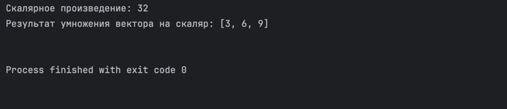
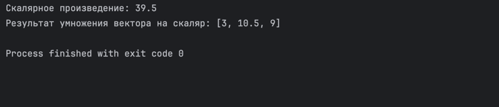
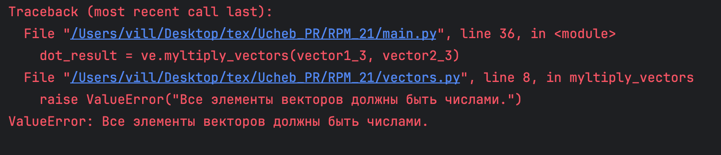
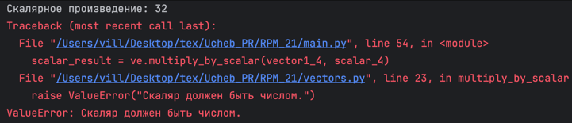
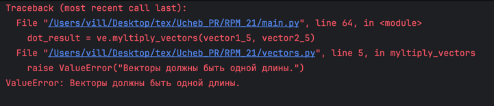

# Практическая работа №21 #

### Тема: Составление собственной библиотеки ###

### Цель: Совершенствование навыков составления программ со своей библиотекой ###

#### Вариант №12 ####

#### Задача: ####

> Реализовать в виде модуля набор подпрограмм для выполнения следующих операций над
> векторами:
>1) скалярного умножения векторов;
>2) умножения вектора на число.

##### Контрольный пример: #####

> Ввожу:  
vector1 = [1, 2, 3]  
vector2 = [4, 5, 6]  
scalar = 3  
>
> Получаю:  
> "Скалярное произведение: 32  
Результат умножения вектора на скаляр: [3, 6, 9]"


> Ввожу:  
vector1 = [1, 3.5, 3]  
vector2 = [4, 5, 6]  
scalar = 3  
>
> Получаю:  
> "Скалярное произведение: 39.5  
Результат умножения вектора на скаляр: [3, 10.5, 9]"


> Ввожу:  
vector1 = [1, "два", 3]  
vector2 = [4, 5, 6]  
scalar = 3  
>
> Получаю:  
> "Ошибка: Все элементы векторов должны быть числами"


> Ввожу:  
vector1 = [1, 2, 3]  
vector2 = [4, 5, 6]  
scalar = "три"  
>
> Получаю:  
> "Скалярное произведение: 32  
> Ошибка: Скаляр должен быть числом"


> Ввожу:  
vector1 = [1, 2, 3]  
vector2 = [4, 5, 6, 7]  
scalar = 3  
>
> Получаю:  
> "Ошибка: Векторы должны быть одной длины"
##### Системный анализ: #####

> Входные данные: `int scalar`, `list vector1`, `list vector2`    
> Промежуточные данные: `int result`, `list result`, `int scalar`, `list vector1`, `list vector2`   
> Выходные данные: `int result`, `list result`  

##### Блок схема: #####


##### Код программы: #####

```python


def myltiply_vectors(vector1, vector2):
   if len(vector1) != len(vector2):
      raise ValueError("Векторы должны быть одной длины.")

   # Проверка, что все элементы векторов - числа
   for v in vector1 + vector2:  # Объединяем два списка в один
      if not isinstance(v, (int, float)):  # Проверяем, является ли тип элемента int или float
         raise ValueError("Все элементы векторов должны быть числами.")

   result = 0
   for i in range(len(vector1)):
      result += vector1[i] * vector2[i]

   return result


def multiply_by_scalar(vector, scalar):
   # Проверка, что скаляр - число
   if not isinstance(scalar, (int, float)):
      raise ValueError("Скаляр должен быть числом.")

   # Проверка, что все элементы вектора - числа
   for v in vector:
      if not isinstance(v, (int, float)):
         raise ValueError("Все элементы вектора должны быть числами.")

   result = []
   for i in range(len(vector)):
      result.append(vector[i] * scalar)

   return result


```

##### Результат работы программы: #####

> Консольное №1:  
Ввожу:  
`vector1 = [1, 2, 3]`      
`vector2 = [4, 5, 6]`     
`scalar = 3`  
Получаю:  


> Консольное №2:  
Ввожу:  
`vector1 = [1, 3.5, 3]`      
`vector2 = [4, 5, 6]`     
`scalar = 3`  
Получаю:  


> Консольное №3:  
Ввожу:  
`vector1 = [1, "два", 3]`      
`vector2 = [4, 5, 6]`     
`scalar = 3`  
Получаю:  


> Консольное №4:  
Ввожу:  
`vector1 = [1, 2, 3]`      
`vector2 = [4, 5, 6]`     
`scalar = "3"`  
Получаю:  


> Консольное №5:  
Ввожу:  
`vector1 = [1, 2, 3]`      
`vector2 = [4, 5, 6, 7]`     
`scalar = 3`  
Получаю:  

##### Контрольные вопросы: #####

1. Модули для работы программы:    
В данной программе не используются внешние модули, она написана только на встроенных возможностях python.  
2. Функции для работы программы:  
`myltiply_vectors(vector1, vector2)`: вычисляет скалярное произведение двух векторов;  
`multiply_by_scalar(vector, scalar)`: умножает вектор на скаляр.


##### Вывод по проделанной работе: #####

> Я совершенствовал навыки составления программ с использованием собственных библиотек