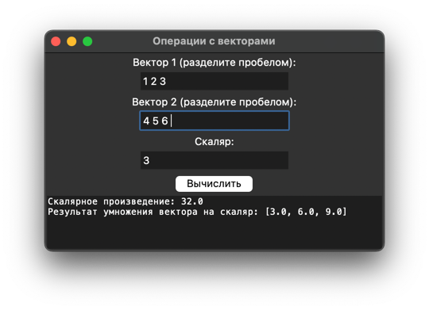

# Практическая работа №21 #

### Тема: Составление собственной библиотеки ###

### Цель: Совершенствование навыков составления программ со своей библиотекой ###

#### Вариант №12 ####

#### Задача: ####

> Реализовать в виде модуля набор подпрограмм для выполнения следующих операций над
> векторами:
>1) скалярного умножения векторов;
>2) умножения вектора на число.

##### Контрольный пример: #####

> Ввожу:  
vector1 = [1, 2, 3]  
vector2 = [4, 5, 6]  
scalar = 3  
>
> Получаю:  
> "Скалярное произведение: 32  
Результат умножения вектора на скаляр: [3, 6, 9]"


> Ввожу:  
vector1 = [1, 3.5, 3]  
vector2 = [4, 5, 6]  
scalar = 3  
>
> Получаю:  
> "Скалярное произведение: 39.5  
Результат умножения вектора на скаляр: [3, 10.5, 9]"


> Ввожу:  
vector1 = [1, "два", 3]  
vector2 = [4, 5, 6]  
scalar = 3  
>
> Получаю:  
> "Ошибка: Все элементы векторов должны быть числами"


> Ввожу:  
vector1 = [1, 2, 3]  
vector2 = [4, 5, 6]  
scalar = "три"  
>
> Получаю:  
> "Скалярное произведение: 32  
> Ошибка: Скаляр должен быть числом"


> Ввожу:  
vector1 = [1, 2, 3]  
vector2 = [4, 5, 6, 7]  
scalar = 3  
>
> Получаю:  
> "Ошибка: Векторы должны быть одной длины"
##### Системный анализ: #####

> Входные данные: `int scalar`, `list vector1`, `list vector2`    
> Промежуточные данные: `int result`, `list result`, `int scalar`, `list vector1`, `list vector2`   
> Выходные данные: `int result`, `list result`  

##### Блок схема: #####


##### Код программы: #####

```python


def myltiply_vectors(vector1, vector2):
   if len(vector1) != len(vector2):
      raise ValueError("Векторы должны быть одной длины.")

   # Проверка, что все элементы векторов - числа
   for v in vector1 + vector2:  # Объединяем два списка в один
      if not isinstance(v, (int, float)):  # Проверяем, является ли тип элемента int или float
         raise ValueError("Все элементы векторов должны быть числами.")

   result = 0
   for i in range(len(vector1)):
      result += vector1[i] * vector2[i]

   return result


def multiply_by_scalar(vector, scalar):
   # Проверка, что скаляр - число
   if not isinstance(scalar, (int, float)):
      raise ValueError("Скаляр должен быть числом.")

   # Проверка, что все элементы вектора - числа
   for v in vector:
      if not isinstance(v, (int, float)):
         raise ValueError("Все элементы вектора должны быть числами.")

   result = []
   for i in range(len(vector)):
      result.append(vector[i] * scalar)

   return result

```

```python
import tkinter as tk
from tkinter import messagebox
import vectors as ve


def calculate():
    result_text.delete(1.0, tk.END)  # Очищаем текстовое поле перед расчетом
    try:
        # Получаем входные данные
        vector1_input = vector1_entry.get().strip().split()
        vector2_input = vector2_entry.get().strip().split()

        # Преобразование строк в числа с помощью обычных циклов
        vector1 = []
        for x in vector1_input:
            vector1.append(float(x))

        vector2 = []
        for x in vector2_input:
            vector2.append(float(x))

        scalar = float(scalar_entry.get().strip())

        # Здесь будут выполнены проверки из вашей библиотеки
        dot_result = ve.myltiply_vectors(vector1, vector2)  # Скалярное произведение
        scalar_result = ve.multiply_by_scalar(vector1, scalar)  # Умножение вектора на скаляр

        # Отображение результатов
        result_dot_text = f"Скалярное произведение: {dot_result}\n"
        result_scalar_text = f"Результат умножения вектора на скаляр: {scalar_result}\n"
        result_text.insert(tk.END, result_dot_text + result_scalar_text)

    except ValueError as e:
        messagebox.showerror("Ошибка", str(e))  # Отображение ошибки в случае неверного ввода


# Создание основного окна приложения
root = tk.Tk()
root.title("Операции с векторами")

# Ввод данных
tk.Label(root, text="Вектор 1 (разделите пробелом):").pack()
vector1_entry = tk.Entry(root)
vector1_entry.pack()

tk.Label(root, text="Вектор 2 (разделите пробелом):").pack()
vector2_entry = tk.Entry(root)
vector2_entry.pack()

tk.Label(root, text="Скаляр:").pack()
scalar_entry = tk.Entry(root)
scalar_entry.pack()

# Кнопка для выполнения расчетов
calculate_button = tk.Button(root, text="Вычислить", command=calculate)
calculate_button.pack()

# Поле для отображения результатов
result_text = tk.Text(root, height=5, width=60)
result_text.pack()

# Запуск основного цикла приложения
root.mainloop()

```

##### Результат работы программы: #####

> Оконное №1:  
Ввожу:  
`vector1 = [1, 2, 3]`      
`vector2 = [4, 5, 6]`     
`scalar = 3`  
Получаю:  


> Оконное №2:  
Ввожу:  
`vector1 = [1, 3.5, 3]`      
`vector2 = [4, 5, 6]`     
`scalar = 3`  
Получаю:  


> Оконное №3:  
Ввожу:  
`vector1 = [1, "два", 3]`      
`vector2 = [4, 5, 6]`     
`scalar = 3`  
Получаю:  


> Оконное №4:  
Ввожу:  
`vector1 = [1, 2, 3]`      
`vector2 = [4, 5, 6]`     
`scalar = "три"`  
Получаю:  


> Оконное №5:  
Ввожу:  
`vector1 = [1, 2, 3]`      
`vector2 = [4, 5, 6, 7]`     
`scalar = 3`  
Получаю:  
 
##### Контрольные вопросы: #####

1. Модули для работы программы:    
В данной программе не используются внешние модули, она написана только на встроенных возможностях python.  
2. Функции для работы программы:  
`myltiply_vectors(vector1, vector2)`: вычисляет скалярное произведение двух векторов;  
`multiply_by_scalar(vector, scalar)`: умножает вектор на скаляр.


##### Вывод по проделанной работе: #####

> Я совершенствовал навыки составления программ с использованием собственных библиотек